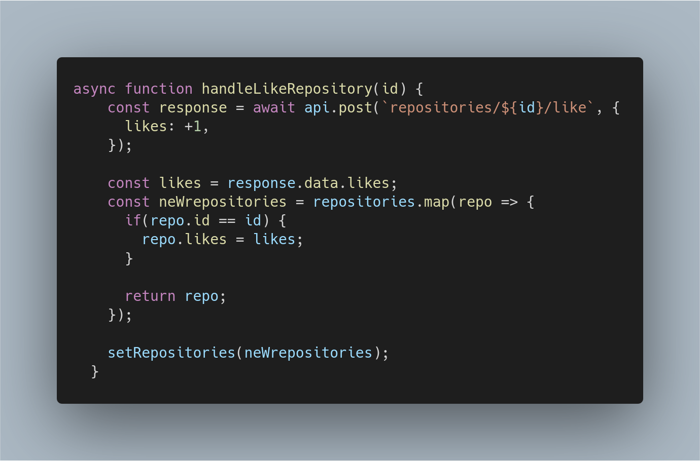

# Bootcamp Desafio 04 - Conceitos React Native
Nesse desafio, foi dado um template de projeto em React Native. Onde o propósito era terminá-lo, de forma a atender as Funcionalidades pedidas em **[Desafio](https://github.com/Rocketseat/bootcamp-gostack-desafios/tree/master/desafio-conceitos-react-native)**.

<p align="center">
  
</p>
 
 A imagem acima retrata o app em ação, listando os repositórios e suas informações. Na imagem, também é visto o botão de curtir, individual para cada repositório.

## Para executar

Antes de tudo, colocar o link do servidor a ser utilizado para a aplicação em `src/services api.js`.

```
yarn
npx react-native run-android
npx react-native start
```

## Funcionalidades da aplicação


- **`Listar os repositórios da API`**: Criar uma lista com os repositórios cadastrados na API, contendo os campos: title, techs e número de likes.
<p align="center">
  
</p>

No código acima o `useEffect` tem o objetivo de receber os repositórios inicialmente, e os adicionar ao array. Posteriormente, este array é renderizado pelo componente `FlatList`.

- **`Curtir um repositório listado da API`**: Curtir um item na API através de um botão com o texto <strong>Curtir</strong> e atualizar o número de likes na listagem ativa no mobile.
<p align="center">
  
</p>

Na função acima, ocorre um envio de requisição para a rota de `likes`, somando-se +1 like cada vez que ela é executada. Em seguida, a response é armazenada na `const likes`, a ser utilizada para trocar o valor dos likes correspondente ao respositório modificado, na copia dos repositórios em `newRepositories`. Posteriormente, este é introduzido em `setRepositories()`, trocando os valores da `repositories`. 

## Para Mais Detalhes

Para mais detalhes a respeio do desafio, checar página oficial do mesmo em **[Desafio](https://github.com/Rocketseat/bootcamp-gostack-desafios/tree/master/desafio-conceitos-react-native)**.